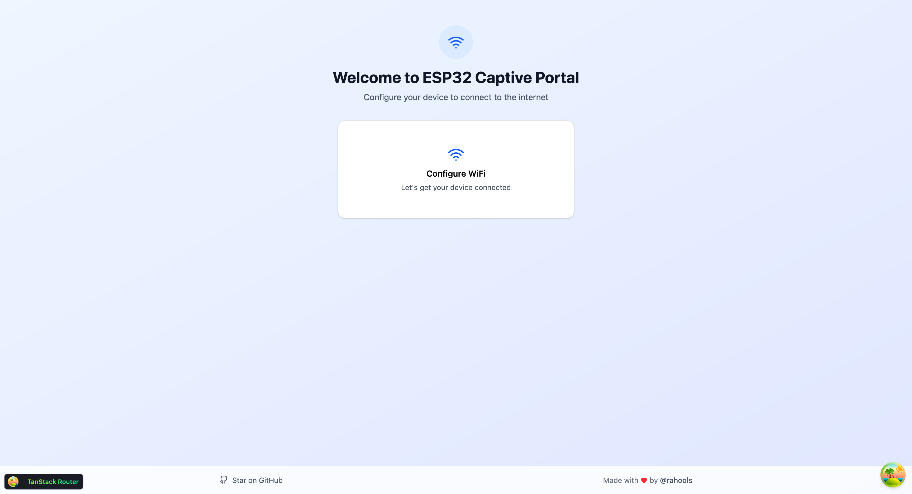
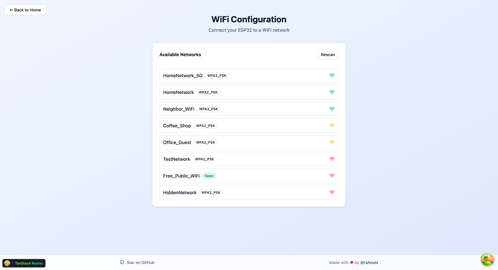
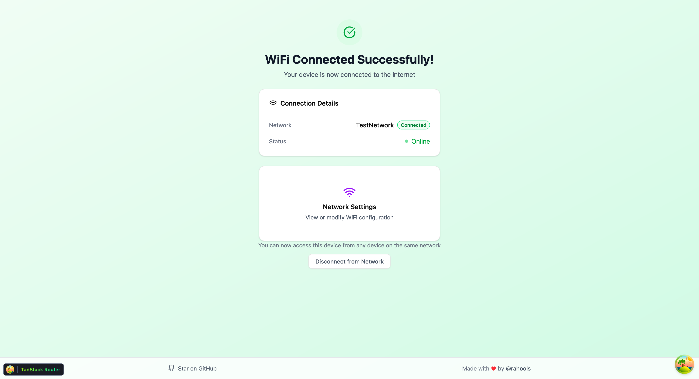

# ESP32 Vite WebApp

A modern, lightweight web UI template for ESP32 projects that combines contemporary web technologies with embedded development. This project creates a WiFi captive portal with a responsive, professional interface using Vite, Preact, TailwindCSS v4, and Shadcn UI.

## ✨ Features

- 🚀 **Modern Web Stack**: Built with Vite, Preact, TypeScript, and TailwindCSS v4
- 🎨 **Beautiful UI**: Shadcn UI components with Radix UI primitives
- 🛜 **WiFi Captive Portal**: Automatic setup portal for network configuration
- 📱 **Responsive Design**: Mobile-friendly interface that works on all devices
- 🔒 **Secure Connections**: Support for WPA2/WPA3 networks
- 🔄 **Type Safety**: Full TypeScript support throughout the application
- ⚡ **Fast Development**: Hot reload with Vite dev server and mock APIs
- 🛠️ **Code Quality**: Automated formatting with Biome and clang-format
- 📦 **Easy Deployment**: PlatformIO-based ESP32 development workflow

## 📸 Screenshots

**Welcome Page** - Main landing page for the ESP32 captive portal


**WiFi Configuration** - Network selection and connection interface


**Connected Status** - Display showing successful WiFi connection


## 🏗️ Technology Stack

### Frontend

- **Preact** - Lightweight React alternative (10KB)
- **Vite** - Modern build tool and development server
- **TailwindCSS v4** - Utility-first CSS framework
- **TanStack Router** - Type-safe file-based routing
- **TanStack Query** - Data fetching and state management
- **Shadcn UI** - Component library built on Radix UI
- **TypeScript** - Type-safe JavaScript

### ESP32/Embedded

- **PlatformIO** - Professional embedded development platform
- **Arduino Framework** - ESP32 Arduino core
- **ESPAsyncWebServer** - Asynchronous web server
- **AsyncTCP** - Asynchronous TCP library
- **ArduinoJson** - JSON parsing and generation
- **LittleFS** - Lightweight filesystem

## 📁 Project Structure

```
esp32-vite-webapp/
├── src/                           # Source code (web + ESP32)
│   ├── components/                # Preact components
│   │   ├── ui/                   # Shadcn UI components
│   │   ├── reboot-countdown/     # Reboot countdown component
│   │   ├── welcome-page/         # Welcome page component
│   │   ├── wifi-connected/       # WiFi connected state
│   │   ├── wifi-settings/        # WiFi settings page
│   │   └── wifi-unconnected/     # WiFi unconnected state
│   ├── esp/                      # ESP32 C++ code
│   │   ├── WiFiUtils.cpp         # WiFi utilities implementation
│   │   └── WiFiUtils.h           # WiFi utilities header
│   ├── hooks/                    # Custom React hooks
│   │   ├── use-wifi-config.ts    # WiFi configuration hook
│   │   ├── use-wifi-connect.ts   # WiFi connection hook
│   │   └── use-wifi-scan.ts      # WiFi scanning hook
│   ├── lib/                      # Utility libraries
│   ├── routes/                   # File-based routing
│   │   ├── __root.tsx            # Root layout
│   │   ├── index.tsx             # Home page
│   │   └── wifi-settings.tsx     # WiFi settings page
│   ├── app.tsx                   # Application root
│   ├── main.tsx                  # Web app entry point
│   └── main.cpp                  # ESP32 entry point
├── data/                         # Built web app (generated)
├── public/                       # Static assets
├── .husky/                       # Git hooks
├── platformio.ini               # PlatformIO configuration
├── vite.config.ts               # Vite configuration
├── biome.json                   # Code formatting config
└── package.json                 # npm configuration
```

## 🚀 Getting Started

### Prerequisites

- Node.js (v18+) and pnpm
- PlatformIO IDE or CLI
- ESP32 development board (tested with Seeed XIAO ESP32-C6)

### Development

1. **Install dependencies**

   ```bash
   pnpm install
   ```

2. **Start development server**

   ```bash
   pnpm run dev
   ```

   This starts the Vite dev server with mock API endpoints.

3. **Build for production**
   ```bash
   pnpm run build
   ```

### ESP32 Deployment

1. **Upload web app to ESP32**

   ```bash
   pnpm run upload-data
   ```

2. **Upload ESP32 firmware**

   ```bash
   pnpm run upload-main
   ```

3. **Build and upload everything**
   ```bash
   pnpm run dev:hardware
   ```

## 📱 Application Flow

### Web Application

- **Entry Point**: `main.tsx` → `App.tsx`
- **Routing**: File-based routing with TanStack Router
- **Pages**:
  - `/` - Home page with WiFi status display
  - `/wifi-settings` - WiFi network selection and connection
- **State Management**: TanStack Query for API calls
- **UI Components**: Shadcn UI with TailwindCSS styling

### ESP32 Application

- **Entry Point**: `main.cpp`
- **WiFi Management**: `WiFiUtils` class handles scanning and connections
- **Web Server**: AsyncWebServer serves the web app and API endpoints
- **API Endpoints**:
  - `/config` - Get current WiFi configuration
  - `/api/wifi` - GET: Scan networks, POST: Connect to network
  - `/` - Serve the web application

## 🛠️ Development Tools

- **Biome**: JavaScript/TypeScript formatting and linting
- **clang-format**: C++ code formatting
- **Husky**: Git hooks for code quality
- **lint-staged**: Run formatters only on staged files
- **PlatformIO**: ESP32 development and deployment

## 📋 Available Scripts

```bash
# Development
pnpm run dev              # Start Vite dev server with mock APIs
pnpm run build            # Build web app to /data directory
pnpm run preview          # Preview production build

# ESP32 Deployment
pnpm run upload-data      # Upload web app to ESP32 LittleFS
pnpm run upload-main      # Upload ESP32 firmware
pnpm run dev:hardware     # Build and upload both web app and firmware
pnpm run clean            # Clean build artifacts

# Code Quality
pnpm run format           # Format all files
pnpm run format:check     # Check formatting without changes
pnpm run lint             # Run linter
```

## 🎯 Hardware Configuration

This project is configured for the **Seeed XIAO ESP32-C6** board but can be easily adapted for other ESP32 variants by modifying the `platformio.ini` file.

## 📄 License

This project is open source and available under the [MIT License](LICENSE).
